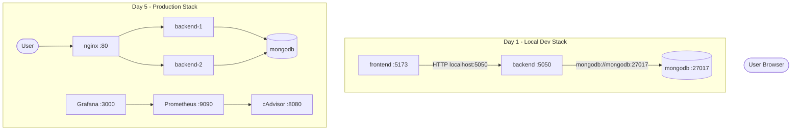

# MERN DevOps Internship Project

Full-stack MERN application with Docker, Docker Compose, Docker Hub, GitHub Actions CI/CD, deployment setup, Nginx load balancing, and Prometheus/Grafana monitoring.

## Architecture



## Project Structure

```
MERN-docker-compose/
├── mern/
│   ├── frontend/          # React + Vite
│   │   ├── Dockerfile
│   │   └── nginx/default.conf
│   └── backend/           # Node.js + Express
│       └── Dockerfile
├── docker-compose.yml     # Day 1: frontend + backend + mongodb
├── docker-compose.prod.yml# Day 5: nginx + 2 backends + monitoring
├── docker-compose.pull.yml# Day 2: run pre-built images from Docker Hub
├── nginx/nginx.conf       # Reverse proxy + load balancing
├── monitoring/            # Prometheus + Grafana configs
├── render.yaml            # Render deployment blueprint
├── .github/workflows/
│   ├── ci.yml             # Test, lint, build, push images
│   └── deploy.yml         # Trigger Render deploy hook on merge
└── .env.example
```

---

## Day 1: Dockerization & Orchestration

### Start the application

```bash
docker compose up -d --build
```

| Service  | URL                      | Purpose              |
|----------|--------------------------|----------------------|
| Frontend | http://localhost:5173    | React UI             |
| Backend  | http://localhost:5050    | REST API             |
| MongoDB  | localhost:27017          | Database             |

### Verify

```bash
curl http://localhost:5050/health    # {"status":"ok"}
curl http://localhost:5050/record    # []
docker compose ps
```

### Networking

Containers communicate on the `mern_network` bridge using **service names** as hostnames:

```
frontend → http://localhost:5050 (browser)
backend  → mongodb://mongodb:27017 (container DNS)
```

```bash
docker network inspect mern_network
```

### Volume persistence proof

```bash
# Insert test data
curl -X POST http://localhost:5050/record \
  -H "Content-Type: application/json" \
  -d '{"name":"persistence-test","position":"devops"}'

# Stop and remove containers (volume is kept)
docker compose down

# Start again — data remains
docker compose up -d
curl http://localhost:5050/record
```

```bash
docker volume inspect mongo-data
```

### Git workflow

```bash
git checkout main && git pull origin main
git checkout -b feature/my-change
git add . && git commit -m "Describe your change"
git push -u origin feature/my-change
gh pr create --base main --title "My change"
```

**Branch protection** (GitHub → Settings → Branches):

- Require pull requests before merging to `main` / `production`
- Require status check: `test-and-build`
- Block direct pushes to protected branches

---

## Day 2: Docker Hub & Registry

### Login

```bash
docker login
# Username: your-dockerhub-username
# Password: Personal Access Token from https://hub.docker.com/settings/security
```

### Build, tag, and push

```bash
docker compose build

docker tag local/backend-app:dev   your-dockerhub-username/backend-app:latest
docker tag local/frontend-app:dev  your-dockerhub-username/frontend-app:latest
docker tag local/backend-app:dev  your-dockerhub-username/backend-app:1.0.0
docker tag local/backend-app:dev  your-dockerhub-username/backend-app:$(git rev-parse --short HEAD)

docker push your-dockerhub-username/backend-app:latest
docker push your-dockerhub-username/frontend-app:latest
docker push your-dockerhub-username/backend-app:1.0.0
```

| Tag type         | Example              | Use case                    |
|------------------|----------------------|-----------------------------|
| `latest`         | `backend-app:latest` | Default rolling image       |
| Semantic version | `backend-app:1.0.0`  | Release milestones          |
| Git SHA          | `backend-app:abc1234`| Traceability to exact commit|

### Run on another machine (no source code)

```bash
docker login
docker pull your-dockerhub-username/backend-app:latest
docker pull your-dockerhub-username/frontend-app:latest
```

Edit `docker-compose.pull.yml` (replace `YOUR_DOCKERHUB_USERNAME`), then:

```bash
docker compose -f docker-compose.pull.yml up -d
```

---

## Day 3: CI Pipeline (GitHub Actions)

Workflow: `.github/workflows/ci.yml`

**Triggers:** Pull request or push to `main` / `production`

**Steps:**
1. Checkout code
2. Setup Node.js 18 (with npm cache)
3. Install dependencies
4. Lint frontend (`npm run lint`)
5. Test backend (`npm test`)
6. Build frontend (`npm run build`)
7. Build Docker images (with GitHub Actions layer cache)
8. Push images to Docker Hub (push only on merge, not on PR)

**Required GitHub Secrets:**

| Secret             | Description                    |
|--------------------|--------------------------------|
| `DOCKER_USERNAME`  | Docker Hub username            |
| `DOCKER_PASSWORD`  | Docker Hub access token        |

**Verify CI:** Open a PR to `main` → Actions tab → confirm `test-and-build` job passes.

---

## Day 4: Continuous Deployment

Workflow: `.github/workflows/deploy.yml` — triggers Render deploy hook after merge to `main`.

**Required secret:** `RENDER_DEPLOY_HOOK_URL`

### Render setup

1. Connect GitHub repo at https://render.com
2. Use `render.yaml` blueprint or create services manually
3. Set env vars in Render dashboard (never commit secrets):
   - Backend: `MONGO_URI`, `PORT=5050`
   - Frontend: `VITE_API_URL=https://your-backend.onrender.com`

### Cloud VM alternative

```bash
git clone https://github.com/<you>/MERN-docker-compose.git
cd MERN-docker-compose
cp .env.example .env
docker compose -f docker-compose.prod.yml up -d --build
curl http://localhost/health
```

### Health checks & logs

```bash
curl -i http://localhost/health
docker compose logs -f backend
docker compose -f docker-compose.prod.yml logs -f nginx
```

**Zero downtime concept:** `docker-compose.prod.yml` runs `backend-1` and `backend-2` behind Nginx. Replace one replica at a time while Nginx routes to the healthy upstream.

---

## Day 5: Production Architecture

### Start production stack

```bash
docker compose -f docker-compose.prod.yml up -d --build
```

| Service     | URL                        |
|-------------|----------------------------|
| Nginx API   | http://localhost/health    |
| Frontend    | http://localhost:5173      |
| Prometheus  | http://localhost:9090      |
| Grafana     | http://localhost:3000      |
| cAdvisor    | http://localhost:8080      |

Grafana login: `admin` / `admin` → open **MERN Container Metrics** dashboard.

Nginx load balances between `backend-1` and `backend-2` using `least_conn` (see `nginx/nginx.conf`).

---

## Complete Command Guide

### Docker

| Command | What it does | Expected output |
|---------|--------------|-----------------|
| `docker compose build` | Build images from Dockerfiles | `Built` for each service |
| `docker compose up -d` | Start containers in background | Containers `Started` |
| `docker compose down` | Stop and remove containers | Containers `Removed` |
| `docker ps` | List running containers | frontend, backend, mongodb |
| `docker compose logs backend` | View backend logs | `Server listening on port 5050` |
| `docker network inspect mern_network` | Show bridge network | Containers attached to network |
| `docker volume inspect mongo-data` | Show volume mount path | `"Name": "mongo-data"` |

### Docker Hub

| Command | What it does |
|---------|--------------|
| `docker login` | Authenticate to Docker Hub |
| `docker tag local/backend-app:latest user/backend-app:latest` | Rename image for registry |
| `docker push user/backend-app:latest` | Upload image to Docker Hub |
| `docker pull user/backend-app:latest` | Download image on another machine |

### Git & CI

| Command | What it does |
|---------|--------------|
| `git checkout -b feature/x` | Create feature branch |
| `git commit -m "msg"` | Save changes locally |
| `git push -u origin feature/x` | Push branch to GitHub |
| `gh pr create --base main` | Open pull request |
| GitHub → Actions tab | Verify CI pipeline ran |

### Monitoring

```bash
docker compose -f docker-compose.prod.yml up -d nginx prometheus grafana cadvisor
curl http://localhost/health
curl http://localhost:9090/-/healthy
```

---

## Instructor Demo Checklist

- [ ] `docker compose up -d --build` — all 3 services healthy
- [ ] `curl http://localhost:5050/health` returns `{"status":"ok"}`
- [ ] Frontend loads at http://localhost:5173
- [ ] `docker network inspect mern_network` shows all containers
- [ ] Volume persistence: insert data → `docker compose down` → `up` → data remains
- [ ] `docker tag` + `docker push` to Docker Hub
- [ ] `docker compose -f docker-compose.pull.yml up -d` on clean machine
- [ ] GitHub Actions CI passes on PR
- [ ] `docker compose -f docker-compose.prod.yml up -d` — Nginx load balances 2 backends
- [ ] Grafana dashboard shows CPU/memory metrics

---

## Troubleshooting

| Error | Fix |
|-------|-----|
| `port is already allocated` | `docker compose down` or `sudo lsof -i :5050` and stop conflicting process |
| `Cannot connect to MongoDB` | Wait for mongodb healthcheck: `docker compose ps` shows `(healthy)` |
| `docker login` fails | Use access token, not account password |
| CI lint fails | Run `cd mern/frontend && npm run lint` locally |
| Frontend can't reach API | Set `VITE_API_URL=http://localhost:5050` (browser uses host, not container name) |
| Grafana empty dashboard | Wait 1–2 min for Prometheus to scrape cAdvisor |
| Permission denied on Docker | `sudo usermod -aG docker $USER && newgrp docker` |

---

## Files Reference

| File | Purpose |
|------|---------|
| `docker-compose.yml` | Day 1 dev stack |
| `docker-compose.prod.yml` | Day 5 nginx + replicas + monitoring |
| `docker-compose.pull.yml` | Day 2 registry-only deployment |
| `.github/workflows/ci.yml` | CI: test, lint, build, push |
| `.github/workflows/deploy.yml` | CD: Render deploy hook |
| `nginx/nginx.conf` | Reverse proxy + load balancing |
| `monitoring/prometheus/prometheus.yml` | Metrics scrape config |
| `render.yaml` | Render cloud deployment blueprint |
