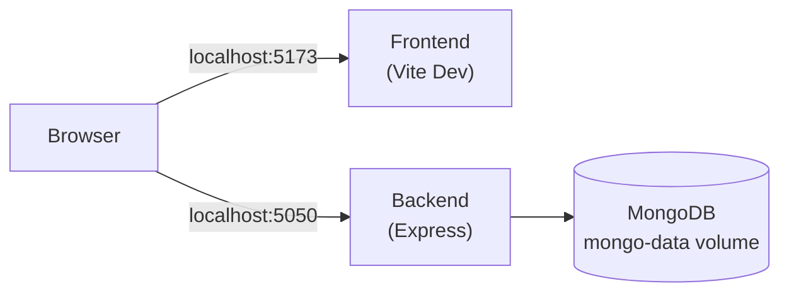
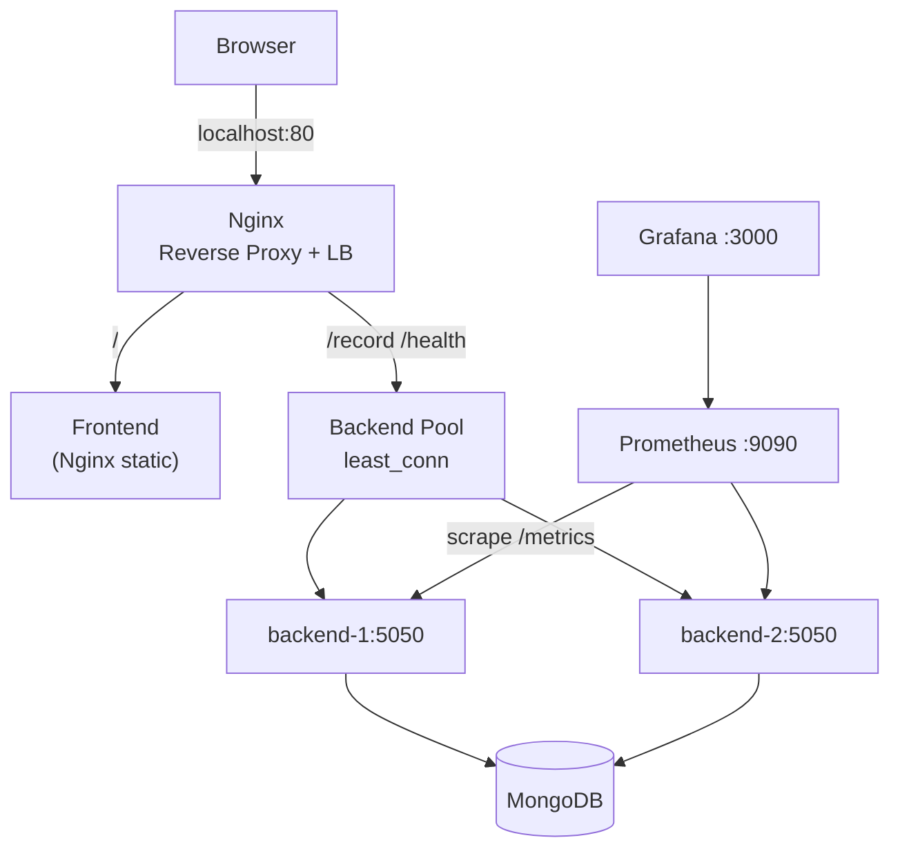

# MERN Docker Compose — Production Internship Project

A production-ready **Employee Records** MERN application demonstrating Docker containerization, Docker Hub registry management, GitHub Actions CI/CD, cloud deployment, Nginx load balancing, and Prometheus/Grafana monitoring.

---

## Project Overview

| Layer | Technology | Purpose |
|-------|-----------|---------|
| Frontend | React 18 + Vite 5 | Employee CRUD UI |
| Backend | Node.js + Express 4 | REST API |
| Database | MongoDB 7 | Persistent document storage |
| Reverse Proxy | Nginx 1.25 | Routing + load balancing |
| Monitoring | Prometheus + Grafana | Metrics & dashboards |
| CI/CD | GitHub Actions | Lint, test, build, push, deploy |
| Cloud | Render | Automatic deployment |

---

## Architecture Diagram

### Day 1 — Development Stack



### Day 5 — Production Stack



---

## Folder Structure

```
MERN-docker-compose/
├── .github/workflows/ci-cd.yml   # CI/CD pipeline
├── docker-compose.yml            # Day 1 dev stack
├── docker-compose.hub.yml        # Day 2 Hub images only
├── docker-compose.prod.yml       # Day 5 production stack
├── render.yaml                   # Day 4 Render blueprint
├── scripts/build-and-push.sh     # Day 2 build/tag/push script
├── nginx/
│   ├── nginx.conf                # Production reverse proxy + LB
│   └── nginx-hub.conf            # Hub compose proxy
├── prometheus/prometheus.yml     # Scrape config
├── grafana/
│   ├── dashboards/               # Grafana dashboard JSON
│   └── provisioning/             # Auto-provision datasources
└── mern/
    ├── backend/
    │   ├── Dockerfile
    │   ├── server.js             # Express + /health + /metrics
    │   ├── db/connection.js
    │   ├── routes/record.js
    │   └── tests/api.test.js
    └── frontend/
        ├── Dockerfile            # Dev (Vite)
        ├── Dockerfile.prod       # Production (Nginx static)
        └── src/
```

---

## Technology Stack

- **MongoDB 7** — Document database with named volumes
- **Express 4 + prom-client** — REST API with Prometheus metrics
- **React 18 + Vite 5** — SPA with Vitest unit tests
- **Nginx 1.25** — Reverse proxy and load balancer (`least_conn`)
- **Prometheus 2.51** — Metrics collection
- **Grafana 10.4** — Dashboards and visualization
- **GitHub Actions** — CI/CD automation
- **Render** — Cloud deployment platform
- **Docker Hub** — Container registry

---

## Installation

### Prerequisites

- [Docker Desktop](https://www.docker.com/products/docker-desktop/)
- [Git](https://git-scm.com/)
- [Node.js 18+](https://nodejs.org/) (for local development/testing)
- [Docker Hub account](https://hub.docker.com/)
- [Render account](https://render.com/) (for Day 4)
- [GitHub account](https://github.com/)

```bash
docker --version
docker compose version
node --version
```

---

## Day 1 — Docker Compose (Development)

Start the complete application with one command:

```bash
docker compose up --build
```

| Service | URL |
|---------|-----|
| Frontend | http://localhost:5173 |
| Backend | http://localhost:5050 |
| Health | http://localhost:5050/health |

### Persistence Demo

```bash
curl -X POST http://localhost:5050/record \
  -H "Content-Type: application/json" \
  -d '{"name":"Persistence Test","position":"Intern","level":"Junior"}'

docker compose down        # removes containers, keeps volume
docker compose up -d       # restart
curl http://localhost:5050/record   # data persists
```

**Why persistence works:** The `mongo-data` named volume stores data on the Docker host. `docker compose down` removes containers but not volumes. Use `docker compose down -v` to wipe data.

---

## Day 2 — Docker Hub & Registry

### Image Tagging Strategy

| Tag | Example | Purpose |
|-----|---------|---------|
| Semantic version | `myuser/mern-backend:1.0.0` | Release tracking |
| `latest` | `myuser/mern-backend:latest` | Default pull tag |
| Git SHA | `myuser/mern-backend:sha-a1b2c3d` | Traceability to commit |

### Login & Push

```bash
# Create access token at https://hub.docker.com/settings/security
docker login -u YOUR_USERNAME

# Build, tag, and push all images
./scripts/build-and-push.sh YOUR_USERNAME 1.0.0
```

### Pull & Run Without Source Code

On any machine with Docker (no repo clone needed):

```bash
export DOCKERHUB_USERNAME=YOUR_USERNAME
docker compose -f docker-compose.hub.yml pull
docker compose -f docker-compose.hub.yml up -d
```

Access: **http://localhost**

### Registry Best Practices

- Use **access tokens**, never account passwords
- Tag with **semver + SHA + latest**
- Use namespaced repos: `username/mern-backend`
- Never push secrets into images — use env vars at runtime

---

## Day 3 — Continuous Integration

### Pipeline: `.github/workflows/ci-cd.yml`

| Trigger | Jobs | Result |
|---------|------|--------|
| Pull Request | `lint-and-test` | Validates code; blocks merge on failure |
| Push to `main` | `lint-and-test` → `build-and-push` → `deploy` | Full CI/CD |

### Workflow Sections Explained

1. **Checkout** — Clones repo at triggering commit
2. **Setup Node + Cache** — Installs Node 18; caches `node_modules`
3. **Backend tests** — Runs against MongoDB service container
4. **Frontend lint/test/build** — ESLint + Vitest + Vite build
5. **Docker build & push** — Tags with `latest`, semver, and SHA
6. **Deploy** — Triggers Render deploy hook

### Required GitHub Secrets

| Secret | Description |
|--------|-------------|
| `DOCKERHUB_USERNAME` | Docker Hub username |
| `DOCKERHUB_TOKEN` | Docker Hub access token |
| `RENDER_DEPLOY_HOOK_URL` | Render deploy hook URL |

Add at: **Settings → Secrets and variables → Actions**

### Branch Protection (Recommended)

On `main` branch:
- Require PR before merging
- Require status check: **Lint & Test**
- Require branches to be up to date

---

## Day 4 — Continuous Deployment (Render)

### Setup

1. Connect GitHub repo to [Render](https://render.com/)
2. Apply `render.yaml` blueprint (creates backend, frontend, MongoDB)
3. Set environment variables in Render dashboard
4. Copy deploy hook URL → add as `RENDER_DEPLOY_HOOK_URL` GitHub secret

### Deployment Flow

```
Merge to main → CI passes → Docker push → Render deploy hook → Production URL
```

### Rollback Strategy

- **Render:** Roll back to previous deploy in dashboard (one click)
- **Docker Hub:** Pull previous SHA tag: `myuser/mern-backend:sha-OLD_SHA`
- **Zero downtime:** Render performs rolling deploys; new container starts before old stops

### Production URL

After deploy, Render provides URLs like:
- Backend: `https://mern-backend.onrender.com`
- Frontend: `https://mern-frontend.onrender.com`

---

## Day 5 — Production Architecture

Start the full production stack:

```bash
docker compose -f docker-compose.prod.yml up --build -d
```

| Service | URL | Credentials |
|---------|-----|-------------|
| Application | http://localhost | via Nginx |
| Prometheus | http://localhost:9090 | — |
| Grafana | http://localhost:3000 | admin / admin |

### Components

| Component | Role |
|-----------|------|
| **Nginx** | Single entry point; routes `/` to frontend, `/record` to backend pool |
| **Load Balancer** | `least_conn` algorithm across `backend-1` and `backend-2` |
| **Backend replicas** | 2 instances for high availability |
| **Prometheus** | Scrapes `/metrics` from both backends every 15s |
| **Grafana** | Pre-provisioned MERN dashboard |

### Verify Load Balancing

```bash
for i in $(seq 1 6); do curl -s http://localhost/health; echo; done
```

You should see responses from both `backend-1` and `backend-2`.

### Scaling Concepts

- Add more backend replicas in `docker-compose.prod.yml`
- Update Nginx upstream and Prometheus targets
- Nginx distributes traffic; failed backends removed via `max_fails`

---

## Docker Commands

```bash
# Day 1 — Development
docker compose up --build
docker compose ps
docker compose logs -f backend
docker compose down
docker compose down -v          # also removes volumes

# Day 2 — Docker Hub
docker login
./scripts/build-and-push.sh USERNAME 1.0.0
docker compose -f docker-compose.hub.yml up -d

# Day 5 — Production
docker compose -f docker-compose.prod.yml up --build -d
docker compose -f docker-compose.prod.yml ps
```

---

## Git Commands

```bash
git checkout -b feature/day1-docker-compose
git add .
git commit -m "feat(day1): dockerize MERN stack with health checks"
git push -u origin feature/day1-docker-compose

git checkout -b feature/day3-ci-cd
git commit -m "feat(day3): add GitHub Actions CI/CD pipeline"
```

---

## Local Testing (without Docker)

```bash
# Backend (requires MongoDB on localhost:27017)
cd mern/backend && npm ci && npm test

# Frontend
cd mern/frontend && npm ci && npm run lint && npm test && npm run build
```

---

## Troubleshooting

| Error | Fix |
|-------|-----|
| `port is already allocated` | Stop conflicting service or change port mapping |
| Backend can't connect to MongoDB | Use service name `mongodb`, not `localhost` inside containers |
| Frontend empty table | Check `curl http://localhost:5050/health` |
| CI tests fail | Ensure MongoDB service container is configured in workflow |
| Docker push denied | Verify `DOCKERHUB_TOKEN` secret and repository exists |
| Grafana empty dashboard | Wait 30s for Prometheus to scrape; check targets at `:9090/targets` |
| Data lost after restart | Avoid `docker compose down -v` |

---

## Screenshots

<!-- Add screenshots here -->
| Screenshot | Description |
|------------|-------------|
|  | Docker Compose running |
|  | GitHub Actions CI passing |
|  | Render deployment |
|  | Grafana dashboard |

---

## Future Improvements

- [ ] Kubernetes migration (Helm charts)
- [ ] TLS/HTTPS with Let's Encrypt
- [ ] Redis caching layer
- [ ] Structured logging with ELK stack
- [ ] Automated database backups
- [ ] Multi-environment configs (staging/production)
- [ ] E2E tests with Cypress in CI

---

## License

MIT — see [LICENSE](LICENSE)
